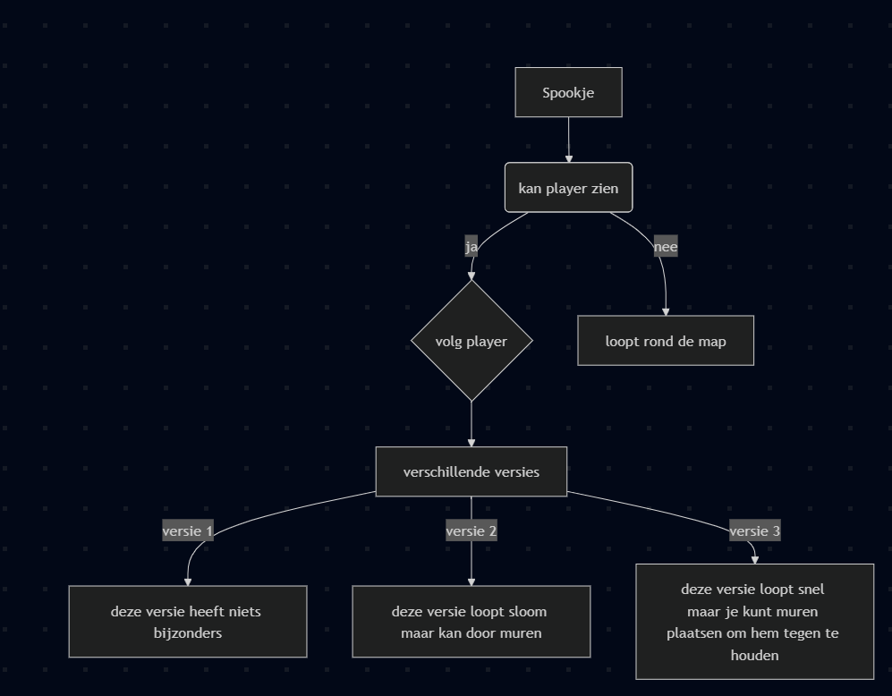

# PacMan

# game idee

**-pacman + templerun movement en obstacels**

**-pacman speedrun (time limit)**

# als we tijd hebben

**--pacman mirrored puzzle**

**--pacman muziek timing**

# Enemy Behavior

-het gedrag zal gelijk activeren als de level gestart wordt

-de trigger dat de spookjes krijgen is als ze pacman raken

-het gedrag zal veranderen als er een meer optimale weg naar pacman wordt gekreerd of als andere spookjes al pacman aan het hunten zijn

-er zullen verschillende versies zijn van onze spook maar de meeste zullen een pad kiezen die uiteindelijk pacman pakken, en een losse spook die beweeg super sloom maar kan door muren lopen, wat zorgt dat pacman niet te lang still blijft staan

-als de spookjes pacman zien wordt het volle vracht vooruit

-en als ze hem niet zien dan zullen ze hem proberen op te sporen todat ze hem zien

-als pacman gepakt wordt of een manier heeft om hun te defeaten

